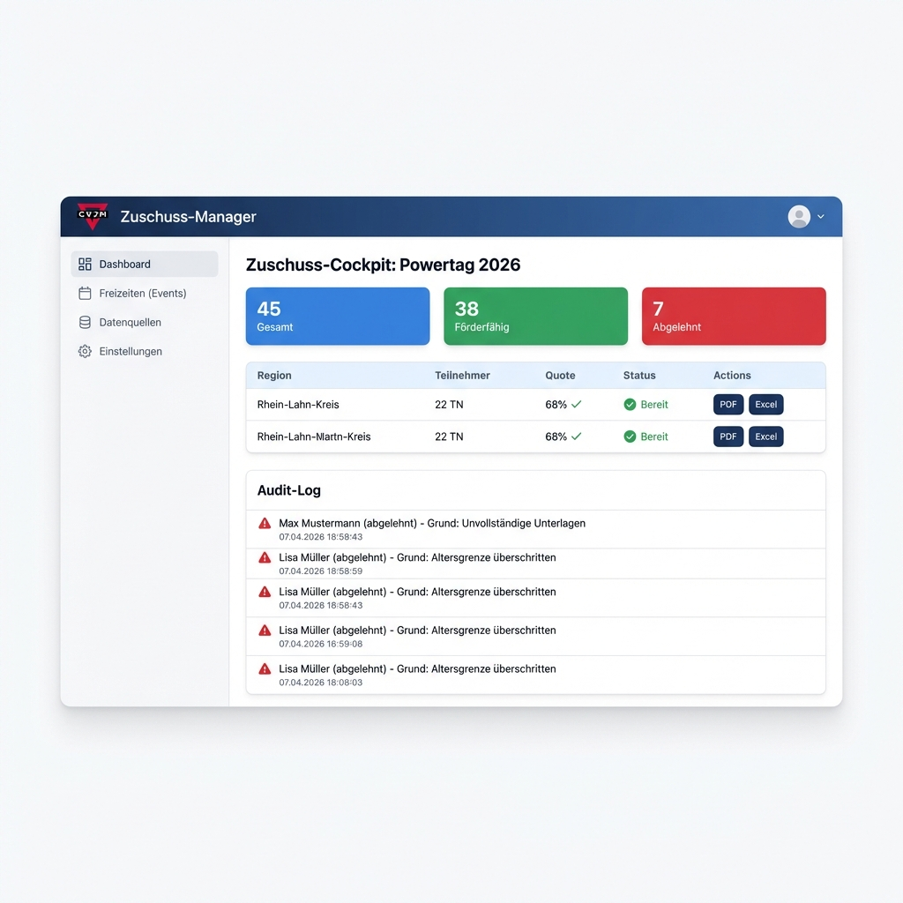

# Vision V11: Modulares Zuschuss-System

*Status: Konzeption abgeschlossen, bereit für Entwicklungsstart*  
*Stand: 31. Januar 2026*

---

## 📁 Dokumentation

| Dokument | Beschreibung |
|----------|--------------|
| [implementation_plan.md](docs/implementation_plan.md) | Technischer Implementierungsplan |
| [feedback_discussion.md](docs/feedback_discussion.md) | Diskussion aller Feedback-Punkte |
| [expertenrunde_v11.md](docs/expertenrunde_v11.md) | Vollständige Experten-Diskussion |

---

## 🖼️ Mockups

---

## 🎯 Kernentscheidungen

| Bereich | Entscheidung |
|---------|--------------|
| **Backend** | Python + FastAPI |
| **Frontend** | React + Next.js 14 + shadcn/ui |
| **Datenbank** | SQLite + Litestream |
| **Templates** | XLSX-basiert (Original-Jugendamts-Vorlagen) |
| **Hosting** | Hetzner Deutschland (DSGVO ✅) |
| **Zeitplan** | ~14 Wochen, CLI-MVP nach 7 Wochen |

---

## 🚀 Nächste Schritte (bei Wiederaufnahme)

1. Repository-Struktur für Backend/Frontend anlegen
2. SQLite Schema implementieren
3. Erste V8-Regel nach Python portieren
4. XLSX-Template-Engine entwickeln
5. Dashboard MVP bauen

---

*Dieses Projekt wird zu einem späteren Zeitpunkt fortgesetzt.*
