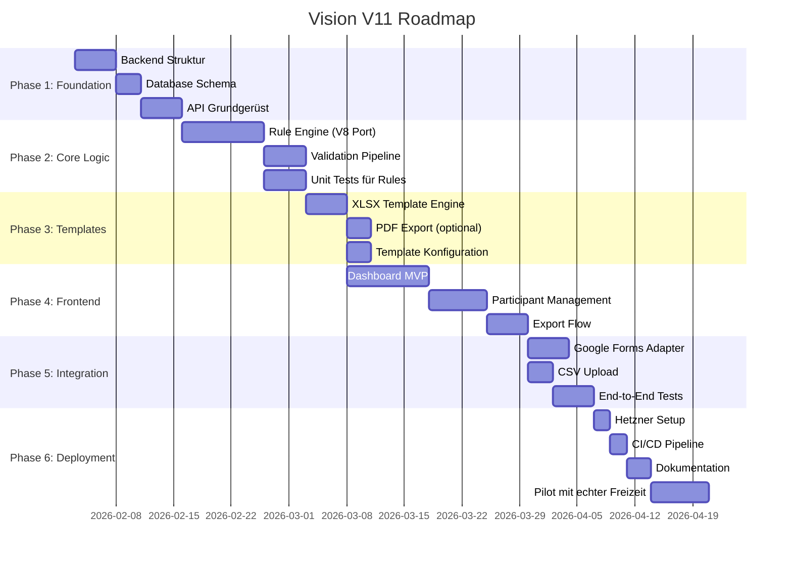

# 🎓 Expertenrunde Vision V11 – Zuschuss-SaaS

*Datum: 31. Januar 2026*  
*Format: Doktoranden-Kolloquium mit Praxisvertreter*  

---

## Teilnehmer der Expertenrunde

| Name | Rolle | Expertise |
|------|-------|-----------|
| **Dr. Elena Petrov** | Chief Architect | Distributed Systems, Cloud Architecture |
| **Dr. Marcus Chen** | Backend Lead | Python, FastAPI, Domain-Driven Design |
| **Dr. Sarah Williams** | Frontend Lead | React, Next.js, Design Systems |
| **Dr. Raj Patel** | Database Architect | PostgreSQL, SQLite, Data Modeling |
| **Dr. Anna Kowalski** | Security Engineer | DSGVO, OAuth, Encryption |
| **Dr. Jonas Berg** | DevOps Lead | Docker, CI/CD, Infrastructure as Code |
| **Dr. Lisa Müller** | UX Researcher | User-Centered Design, Accessibility |
| **Thomas Schneider** | Freizeitleiter (CVJM) | 12 Jahre Praxiserfahrung |

---

## Agenda

1. Problem-Definition & Anforderungsanalyse
2. Architektur-Entscheidungen
3. Backend-Design
4. Frontend-Strategie
5. Datenbank-Modellierung
6. Sicherheit & Datenschutz
7. DevOps & Deployment
8. User Experience
9. Implementierungs-Roadmap
10. Risiken & Mitigationsstrategien

---

## 1. Problem-Definition & Anforderungsanalyse

### Dr. Petrov (Chief Architect):
> Bevor wir über Technologie sprechen, müssen wir das Problem präzise definieren. Herr Schneider, beschreiben Sie bitte Ihren aktuellen Workflow.

### Thomas Schneider (Freizeitleiter):
> Wir organisieren ca. 8-10 Freizeiten pro Jahr. Jede Freizeit hat 20-60 Teilnehmer. Nach der Freizeit müssen wir Zuschusslisten für verschiedene Stellen einreichen:
> 
> 1. **Landkreis-Ebene**: Jeder Teilnehmer, der im Landkreis wohnt, bringt uns ~5€/Tag
> 2. **Landesebene (RLP)**: Alle aus Rheinland-Pfalz → ~3€/Tag
> 3. **Andere Landkreise**: Wenn Teilnehmer aus Nachbarkreisen kommen
>
> Das Problem: Jedes Jugendamt hat **andere Formulare**, andere **Regeln** (Mindestalter, Quoten, Mindestdauer), und wir müssen für jede Freizeit **5-10 verschiedene Listen** erstellen.

### Dr. Petrov:
> Verstanden. Das ist ein klassisches **Multi-Tenant, Multi-Output-Problem**. Die Komplexität liegt nicht in der Datenmenge, sondern in der **Regelvielfalt** und **Output-Formatierung**.

### Dr. Müller (UX):
> Herr Schneider, wie viel Zeit verbringen Sie aktuell mit dieser Verwaltungsarbeit?

### Thomas Schneider:
> Pro Freizeit etwa **8-12 Stunden**. Das ist Zeit, die ich lieber in die Jugendarbeit stecken würde. Und ich mache immer wieder Fehler – vergesse eine Person, falsches Alter, falsche Liste.

### Dr. Chen (Backend):
> Das ist ein klarer ROI-Indikator. Bei 10 Freizeiten × 10 Stunden = 100 Stunden/Jahr. Eine gut designte Software könnte das auf 1-2 Stunden pro Freizeit reduzieren.

---

## 2. Architektur-Entscheidungen

### Dr. Petrov (Chief Architect):
> Ich schlage eine **3-Tier-Architektur** mit klarer Trennung vor:

```
┌─────────────────────────────────────────────────────────────────────┐
│                        PRESENTATION TIER                           │
│  ┌─────────────────┐  ┌─────────────────┐  ┌─────────────────────┐ │
│  │   Web-App       │  │   Mobile PWA    │  │   Admin-Panel       │ │
│  │   (React/Next)  │  │   (PWA)         │  │   (intern)          │ │
│  └────────┬────────┘  └────────┬────────┘  └──────────┬──────────┘ │
└───────────┼────────────────────┼─────────────────────┼─────────────┘
            │                    │                     │
            └────────────────────┼─────────────────────┘
                                 │ REST/GraphQL
┌────────────────────────────────┼───────────────────────────────────┐
│                        APPLICATION TIER                            │
│  ┌─────────────────────────────┴─────────────────────────────────┐ │
│  │                    API Gateway (FastAPI)                      │ │
│  └─────────────────────────────┬─────────────────────────────────┘ │
│            ┌───────────────────┼───────────────────┐               │
│  ┌─────────▼─────────┐ ┌───────▼───────┐ ┌────────▼────────┐      │
│  │  Validation       │ │  Rule Engine  │ │  Export Engine  │      │
│  │  Service          │ │  (V8Logic)    │ │  (PDF/XLSX)     │      │
│  └───────────────────┘ └───────────────┘ └─────────────────┘      │
└────────────────────────────────┬───────────────────────────────────┘
                                 │
┌────────────────────────────────┼───────────────────────────────────┐
│                          DATA TIER                                 │
│  ┌─────────────────┐  ┌────────┴───────┐  ┌─────────────────────┐ │
│  │  SQLite/Postgres│  │  Template Store│  │  File Storage       │ │
│  │  (Transactional)│  │  (XLSX/Config) │  │  (Exports, Backups) │ │
│  └─────────────────┘  └────────────────┘  └─────────────────────┘ │
└────────────────────────────────────────────────────────────────────┘
```

### Dr. Chen (Backend):
> Ich plädiere für **Monolith-First**. Bei unserer Nutzerzahl (< 100 gleichzeitige Nutzer) ist Microservices-Overhead nicht gerechtfertigt.

### Dr. Petrov:
> Einverstanden. **Modularer Monolith** mit klaren Bounded Contexts:

```python
# Bounded Contexts (DDD)
app/
├── events/           # Maßnahmen-Verwaltung
│   ├── domain/       # Entities, Value Objects
│   ├── application/  # Use Cases
│   └── infrastructure/
├── participants/     # Teilnehmer-Management
├── rules/            # Regel-Engine (V8-Logik)
├── exports/          # PDF/XLSX-Generierung
└── datasources/      # Adapter (Google Forms, CSV, etc.)
```

### Dr. Berg (DevOps):
> Dieser Ansatz ermöglicht später **einfache Extraktion** in Services, falls nötig. Aber wir starten lean.

---

## 3. Backend-Design

### Dr. Chen (Backend Lead):

> Kernfrage: Wie bilden wir die V8-Formel-Logik in sauberem Python ab?

#### 3.1 Rule Engine Design

```python
from abc import ABC, abstractmethod
from dataclasses import dataclass
from typing import Protocol, List

# Domain Model
@dataclass(frozen=True)
class Participant:
    """Value Object: Unveränderlich, validiert bei Erstellung"""
    id: str
    vorname: str
    nachname: str
    geburtsdatum: date
    funktion: Funktion
    landkreis: str
    bundesland: str
    
    @property
    def full_name(self) -> str:
        return f"{self.nachname}, {self.vorname}"

@dataclass
class SubsidyRule:
    """Entity: Die Förderregeln eines Zuschussgebers"""
    key: str
    landkreis: str
    event_typ: str
    
    # Mengen-Kriterien
    min_participants: int
    min_participants_scope: str  # "TN", "MA", "ALLE"
    min_duration_days: int
    
    # Alters-Kriterien  
    age_limits: AgeLimits
    
    # Quote
    quota: QuotaConfig
    
    # Output
    output_template: str
    column_mapping: List[ColumnSpec]
    sort_order: List[str]

# Strategy Pattern für Validierung
class ValidationRule(Protocol):
    """Protocol für austauschbare Validierungsregeln"""
    def validate(self, participant: Participant, context: ValidationContext) -> ValidationResult:
        ...

class AgeValidationRule:
    def __init__(self, min_age: int, max_age: int, event_end_date: date):
        self.min_age = min_age
        self.max_age = max_age
        self.event_end_date = event_end_date
    
    def validate(self, p: Participant, ctx: ValidationContext) -> ValidationResult:
        age = self._calculate_age(p.geburtsdatum, self.event_end_date)
        
        if age < self.min_age:
            return ValidationResult.rejected(
                participant=p,
                reason_code="AGE_TOO_YOUNG",
                reason_detail=f"Alter {age} < Minimum {self.min_age}"
            )
        if age > self.max_age:
            return ValidationResult.rejected(
                participant=p,
                reason_code="AGE_TOO_OLD", 
                reason_detail=f"Alter {age} > Maximum {self.max_age}"
            )
        return ValidationResult.accepted(p)

class LocalityValidationRule:
    """Prüft Wohnort-Zugehörigkeit"""
    ...

class QuotaValidationRule:
    """Implementiert die 51%-Logik"""
    ...
```

### Dr. Patel (DBA):
> Die Rule Engine sollte **zustandslos** sein. Regeln werden aus der DB geladen, aber die Engine selbst hält keinen State.

### Dr. Chen:
> Genau. Hier die **Orchestrierung**:

```python
class ValidationOrchestrator:
    """Führt alle Validierungsschritte in korrekter Reihenfolge aus"""
    
    def __init__(self, rule_repository: RuleRepository):
        self.rule_repo = rule_repository
    
    def validate_event(
        self, 
        event: Event, 
        participants: List[Participant],
        rule_key: str
    ) -> ValidationReport:
        
        # 1. Regel laden
        rule = self.rule_repo.get_by_key(rule_key)
        if not rule:
            raise RuleNotFoundError(f"Unbekannte Regel: {rule_key}")
        
        # 2. Kontext erstellen
        context = ValidationContext(
            event=event,
            rule=rule,
            all_participants=participants
        )
        
        # 3. Pipeline aufbauen
        pipeline = self._build_pipeline(rule, context)
        
        # 4. Jeden Teilnehmer durch Pipeline schicken
        results: List[ValidationResult] = []
        for participant in participants:
            result = pipeline.process(participant)
            results.append(result)
        
        # 5. Aggregierte Statistiken berechnen
        return self._build_report(results, context)
    
    def _build_pipeline(self, rule: SubsidyRule, ctx: ValidationContext) -> ValidationPipeline:
        """Baut die Validierungs-Pipeline basierend auf der Regel"""
        return ValidationPipeline([
            StatusValidationRule(),          # Status = "Angemeldet"?
            FunktionValidationRule(rule),    # In Zielgruppe?
            AgeValidationRule(rule, ctx),    # Alter korrekt?
            AttendanceValidationRule(rule),  # Mindest-Anwesenheit?
            LocalityValidationRule(rule),    # Wohnort-Prüfung
            QuotaValidationRule(rule, ctx),  # Quote erfüllt?
        ])
```

### Dr. Williams (Frontend):
> Die API muss diese Ergebnisse so zurückgeben, dass wir sie im Dashboard gut darstellen können.

### Dr. Chen:
> Hier das **Response-Format**:

```python
@dataclass
class ValidationReport:
    """Vollständiger Validierungsbericht für Frontend"""
    
    # Meta
    rule_key: str
    validated_at: datetime
    
    # Ergebnis-Listen
    accepted: List[Participant]
    rejected: List[RejectedParticipant]
    
    # Statistiken
    statistics: ValidationStatistics
    
    # Für Audit-Trail
    warnings: List[str]
    
    def to_api_response(self) -> dict:
        return {
            "success": True,
            "rule_key": self.rule_key,
            "validated_at": self.validated_at.isoformat(),
            "counts": {
                "total": len(self.accepted) + len(self.rejected),
                "accepted": len(self.accepted),
                "rejected": len(self.rejected),
            },
            "accepted_participants": [
                p.to_dict() for p in self.accepted
            ],
            "rejected_participants": [
                {
                    "participant": rp.participant.to_dict(),
                    "reason_code": rp.reason_code,
                    "reason_detail": rp.reason_detail,
                }
                for rp in self.rejected
            ],
            "statistics": {
                "local_count": self.statistics.local_count,
                "local_percentage": self.statistics.local_percentage,
                "quota_met": self.statistics.quota_met,
                "average_age": self.statistics.average_age,
            },
            "warnings": self.warnings,
        }
```

---

## 4. Frontend-Strategie

### Dr. Williams (Frontend Lead):

> Wir haben React + Next.js als Stack gewählt. Hier meine Architektur-Empfehlung:

#### 4.1 Technologie-Begründung

| Entscheidung | Begründung |
|--------------|------------|
| **Next.js 14 App Router** | Server Components reduzieren Bundle-Größe, bessere SEO |
| **TypeScript** | Type-Safety essentiell für komplexe Datenstrukturen |
| **shadcn/ui** | Accessible, customizable, keine Vendor-Lock-in |
| **TanStack Query** | Caching, Optimistic Updates, Auto-Refetch |
| **Zustand** | Einfacher als Redux, ausreichend für unsere Komplexität |

#### 4.2 Komponenten-Hierarchie

```
src/
├── app/                          # Next.js App Router
│   ├── (auth)/
│   │   ├── login/
│   │   └── register/
│   ├── (dashboard)/
│   │   ├── page.tsx              # Übersicht aller Freizeiten
│   │   ├── events/
│   │   │   ├── page.tsx          # Freizeit-Liste
│   │   │   ├── [id]/
│   │   │   │   ├── page.tsx      # Freizeit-Detail
│   │   │   │   ├── participants/
│   │   │   │   ├── validation/
│   │   │   │   ├── export/
│   │   │   │   └── audit/
│   │   │   └── new/
│   │   ├── datasources/
│   │   └── settings/
│   └── api/                      # API Routes (optional)
├── components/
│   ├── ui/                       # shadcn/ui Primitives
│   ├── features/
│   │   ├── events/
│   │   │   ├── EventCard.tsx
│   │   │   ├── EventForm.tsx
│   │   │   └── EventTimeline.tsx
│   │   ├── participants/
│   │   │   ├── ParticipantTable.tsx
│   │   │   ├── ParticipantRow.tsx
│   │   │   └── BulkActions.tsx
│   │   ├── validation/
│   │   │   ├── ValidationDashboard.tsx
│   │   │   ├── RejectionList.tsx
│   │   │   └── StatisticsCards.tsx
│   │   └── export/
│   │       ├── ExportDialog.tsx
│   │       ├── TemplateSelector.tsx
│   │       └── PreviewPane.tsx
│   └── layout/
│       ├── Sidebar.tsx
│       ├── Header.tsx
│       └── MainLayout.tsx
├── lib/
│   ├── api/
│   │   ├── client.ts             # Axios/Fetch Wrapper
│   │   ├── events.ts
│   │   ├── participants.ts
│   │   └── validation.ts
│   ├── hooks/
│   │   ├── useEvents.ts
│   │   ├── useParticipants.ts
│   │   └── useValidation.ts
│   └── utils/
│       ├── date.ts
│       └── formatting.ts
└── types/
    ├── event.ts
    ├── participant.ts
    └── validation.ts
```

### Dr. Müller (UX):

> Aus UX-Sicht schlage ich folgende **Design-Prinzipien** vor:

#### 4.3 UX-Leitlinien

1. **Progressive Disclosure**: Komplexe Funktionen erst zeigen, wenn nötig
2. **Error Prevention**: Validierung während der Eingabe, nicht erst am Ende
3. **Undo/Redo**: Alle destruktiven Aktionen rückgängig machbar
4. **Status-Transparenz**: Immer klar zeigen, wo der Nutzer steht

### Thomas Schneider (Freizeitleiter):
> Was mir wichtig ist: Ich will auf einen Blick sehen, welche Listen ich noch erstellen muss und ob es Probleme gibt.

### Dr. Williams:
> Dafür bauen wir das **Zuschuss-Cockpit**:

```
┌─────────────────────────────────────────────────────────────────────┐
│  📋 Zuschuss-Cockpit: Powertag 2026                                 │
├─────────────────────────────────────────────────────────────────────┤
│                                                                     │
│  🟢 Bereit zum Export                                               │
│  ┌────────────────────────────────────────────────────────────────┐ │
│  │ Rhein-Lahn-Kreis    │ 22 TN │ Quote: 68% ✓ │ [📄]  [📊]  [👁️] │ │
│  │ Rheinland-Pfalz     │ 38 TN │ ≥7 TN ✓      │ [📄]  [📊]  [👁️] │ │
│  └────────────────────────────────────────────────────────────────┘ │
│                                                                     │
│  🟡 Prüfung erforderlich                                            │
│  ┌────────────────────────────────────────────────────────────────┐ │
│  │ Westerwaldkreis     │  5 TN │ ⚠️ 2 ohne PLZ │       [🔧 Fix]   │ │
│  └────────────────────────────────────────────────────────────────┘ │
│                                                                     │
│  ⬜ Keine Teilnehmer                                                │
│  ┌────────────────────────────────────────────────────────────────┐ │
│  │ Altenkirchen        │  0 TN │ -             │                   │ │
│  │ Hessen              │  0 TN │ -             │                   │ │
│  └────────────────────────────────────────────────────────────────┘ │
│                                                                     │
└─────────────────────────────────────────────────────────────────────┘
```

---

## 5. Datenbank-Modellierung

### Dr. Patel (Database Architect):

> Nach Analyse der Anforderungen empfehle ich **SQLite für MVP**, mit klarem Migrationspfad zu PostgreSQL.

#### 5.1 Begründung SQLite

| Faktor | Bewertung |
|--------|-----------|
| Datenmenge | ~5.000 Datensätze/Jahr → SQLite locker ausreichend |
| Concurrency | 1-5 gleichzeitige Nutzer → Kein Problem |
| Wartung | Null → Perfekt für Ein-Mann-Team |
| Backup | `cp database.db backup.db` → Trivial |
| Migration | SQLAlchemy abstrahiert → PostgreSQL in 2h migrierbar |

#### 5.2 Schema-Design

```sql
-- ============================================
-- CORE ENTITIES
-- ============================================

CREATE TABLE organizations (
    id TEXT PRIMARY KEY DEFAULT (lower(hex(randomblob(16)))),
    name TEXT NOT NULL,
    created_at TEXT DEFAULT (datetime('now'))
);

CREATE TABLE users (
    id TEXT PRIMARY KEY DEFAULT (lower(hex(randomblob(16)))),
    organization_id TEXT REFERENCES organizations(id),
    email TEXT UNIQUE NOT NULL,
    password_hash TEXT NOT NULL,
    role TEXT CHECK(role IN ('admin', 'user')) DEFAULT 'user',
    created_at TEXT DEFAULT (datetime('now'))
);

-- ============================================
-- EVENT MANAGEMENT
-- ============================================

CREATE TABLE events (
    id TEXT PRIMARY KEY DEFAULT (lower(hex(randomblob(16)))),
    organization_id TEXT REFERENCES organizations(id),
    
    -- Basis-Daten
    name TEXT NOT NULL,
    event_type TEXT NOT NULL,  -- "Soziale_Bildung", "Schulung", etc.
    location TEXT,
    
    -- Zeitraum
    start_date TEXT NOT NULL,  -- ISO 8601
    end_date TEXT NOT NULL,
    
    -- Status
    status TEXT CHECK(status IN ('draft', 'active', 'completed', 'archived')) DEFAULT 'draft',
    
    -- Metadaten
    created_at TEXT DEFAULT (datetime('now')),
    updated_at TEXT DEFAULT (datetime('now'))
);

CREATE INDEX idx_events_org ON events(organization_id);
CREATE INDEX idx_events_status ON events(status);

-- ============================================
-- PARTICIPANTS
-- ============================================

CREATE TABLE participants (
    id TEXT PRIMARY KEY DEFAULT (lower(hex(randomblob(16)))),
    event_id TEXT REFERENCES events(id) ON DELETE CASCADE,
    
    -- Personal
    vorname TEXT NOT NULL,
    nachname TEXT NOT NULL,
    geburtsdatum TEXT NOT NULL,  -- ISO 8601
    geschlecht TEXT,
    
    -- Funktion
    funktion TEXT CHECK(funktion IN ('TN', 'MA', 'LEITUNG', 'REF')) NOT NULL,
    status TEXT DEFAULT 'Angemeldet',
    
    -- Adresse
    strasse TEXT,
    plz TEXT,
    wohnort TEXT,
    landkreis TEXT,
    bundesland TEXT,
    
    -- Zusatzfelder
    behinderung TEXT,
    sozial TEXT,
    anwesenheit_tage INTEGER,
    
    -- Datenquelle
    source TEXT CHECK(source IN ('manual', 'google_forms', 'csv', 'api')),
    source_id TEXT,  -- ID in der Quelle
    imported_at TEXT,
    
    -- Meta
    created_at TEXT DEFAULT (datetime('now')),
    updated_at TEXT DEFAULT (datetime('now'))
);

CREATE INDEX idx_participants_event ON participants(event_id);
CREATE INDEX idx_participants_landkreis ON participants(landkreis);
CREATE INDEX idx_participants_bundesland ON participants(bundesland);

-- ============================================
-- RULES ENGINE
-- ============================================

CREATE TABLE subsidy_rules (
    id TEXT PRIMARY KEY DEFAULT (lower(hex(randomblob(16)))),
    
    -- Identifikation
    rule_key TEXT UNIQUE NOT NULL,  -- "Landkreis Rhein-Lahn-Kreis_Soziale_Bildung"
    landkreis TEXT NOT NULL,
    event_type TEXT NOT NULL,
    display_name TEXT,
    
    -- Mengen-Regeln (als JSON für Flexibilität)
    quantity_rules TEXT NOT NULL,  -- JSON
    
    -- Alters-Regeln
    age_rules TEXT NOT NULL,  -- JSON
    
    -- Quote-Regeln
    quota_rules TEXT NOT NULL,  -- JSON
    
    -- Target Groups
    target_groups TEXT NOT NULL,  -- JSON Array
    must_be_local TEXT,  -- JSON Array
    
    -- Output-Konfiguration
    template_id TEXT,
    output_columns TEXT NOT NULL,  -- JSON
    label_map TEXT,  -- JSON
    sort_order TEXT,  -- JSON Array
    
    -- Meta
    is_active INTEGER DEFAULT 1,
    version INTEGER DEFAULT 1,
    created_at TEXT DEFAULT (datetime('now')),
    updated_at TEXT DEFAULT (datetime('now'))
);

CREATE INDEX idx_rules_key ON subsidy_rules(rule_key);
CREATE INDEX idx_rules_landkreis ON subsidy_rules(landkreis);

-- ============================================
-- TEMPLATES
-- ============================================

CREATE TABLE export_templates (
    id TEXT PRIMARY KEY DEFAULT (lower(hex(randomblob(16)))),
    
    landkreis TEXT NOT NULL,
    name TEXT NOT NULL,
    description TEXT,
    
    -- Template-Datei (XLSX-Pfad oder Blob)
    template_type TEXT CHECK(template_type IN ('xlsx', 'html')) DEFAULT 'xlsx',
    template_path TEXT,  -- Relativer Pfad im templates/ Ordner
    
    -- Konfiguration
    config TEXT NOT NULL,  -- JSON mit cell_mapping, start_row, etc.
    
    -- Meta
    is_active INTEGER DEFAULT 1,
    created_at TEXT DEFAULT (datetime('now'))
);

-- ============================================
-- PLZ DATABASE
-- ============================================

CREATE TABLE plz_database (
    plz TEXT PRIMARY KEY,
    ort TEXT NOT NULL,
    landkreis TEXT NOT NULL,
    bundesland TEXT NOT NULL
);

CREATE INDEX idx_plz_landkreis ON plz_database(landkreis);

-- ============================================
-- DATA SOURCES
-- ============================================

CREATE TABLE data_sources (
    id TEXT PRIMARY KEY DEFAULT (lower(hex(randomblob(16)))),
    organization_id TEXT REFERENCES organizations(id),
    
    name TEXT NOT NULL,
    source_type TEXT CHECK(source_type IN ('google_forms', 'csv', 'api')) NOT NULL,
    
    -- Konfiguration (verschlüsselt für Credentials)
    config_encrypted TEXT NOT NULL,
    
    -- Mapping
    column_mapping TEXT NOT NULL,  -- JSON
    
    -- Sync-Status
    last_sync_at TEXT,
    last_sync_status TEXT,
    
    is_active INTEGER DEFAULT 1,
    created_at TEXT DEFAULT (datetime('now'))
);

-- ============================================
-- VALIDATION HISTORY (Audit Trail)
-- ============================================

CREATE TABLE validation_runs (
    id TEXT PRIMARY KEY DEFAULT (lower(hex(randomblob(16)))),
    event_id TEXT REFERENCES events(id),
    rule_key TEXT NOT NULL,
    
    -- Ergebnis-Statistiken
    input_count INTEGER NOT NULL,
    accepted_count INTEGER NOT NULL,
    rejected_count INTEGER NOT NULL,
    
    -- Details als JSON (für spätere Analyse)
    statistics TEXT NOT NULL,
    rejected_details TEXT NOT NULL,  -- JSON Array
    
    -- Meta
    validated_by TEXT REFERENCES users(id),
    validated_at TEXT DEFAULT (datetime('now'))
);

CREATE INDEX idx_validation_event ON validation_runs(event_id);

-- ============================================
-- EXPORT HISTORY
-- ============================================

CREATE TABLE exports (
    id TEXT PRIMARY KEY DEFAULT (lower(hex(randomblob(16)))),
    event_id TEXT REFERENCES events(id),
    validation_run_id TEXT REFERENCES validation_runs(id),
    
    -- Export-Details
    format TEXT CHECK(format IN ('pdf', 'xlsx', 'ods', 'csv')),
    template_id TEXT REFERENCES export_templates(id),
    file_path TEXT,
    
    -- Meta
    exported_by TEXT REFERENCES users(id),
    exported_at TEXT DEFAULT (datetime('now'))
);
```

### Dr. Kowalski (Security):
> Wichtiger Hinweis: `config_encrypted` in der `data_sources` Tabelle muss mit AES-256 verschlüsselt werden. API-Keys und OAuth-Tokens dürfen nie im Klartext gespeichert werden.

### Dr. Patel:
> Absolut. Wir nutzen **Fernet** (symmetric encryption) mit einem Key aus Environment-Variable:

```python
from cryptography.fernet import Fernet
import os

class CredentialEncryptor:
    def __init__(self):
        key = os.environ.get("ENCRYPTION_KEY")
        if not key:
            raise EnvironmentError("ENCRYPTION_KEY not set")
        self.fernet = Fernet(key.encode())
    
    def encrypt(self, data: str) -> str:
        return self.fernet.encrypt(data.encode()).decode()
    
    def decrypt(self, token: str) -> str:
        return self.fernet.decrypt(token.encode()).decode()
```

---

## 6. Sicherheit & Datenschutz

### Dr. Kowalski (Security Engineer):

> Da wir mit **personenbezogenen Daten von Minderjährigen** arbeiten, ist dies eine **hochsensible Anwendung**. DSGVO-Compliance ist nicht optional.

#### 6.1 Technische Maßnahmen

| Kategorie | Maßnahme | Implementation |
|-----------|----------|----------------|
| **Encryption at Rest** | SQLite mit SQLCipher | AES-256 verschlüsselte DB-Datei |
| **Encryption in Transit** | TLS 1.3 | HTTPS-only, HSTS Header |
| **Authentication** | OAuth 2.0 + PKCE | NextAuth.js mit lokalen Accounts |
| **Authorization** | RBAC | Admin, User, Viewer Rollen |
| **Input Validation** | Pydantic + Zod | Strikte Schemas |
| **Rate Limiting** | Slowapi | 100 req/min pro User |
| **Audit Logging** | Structured Logs | Alle Datenzugriffe protokolliert |

#### 6.2 DSGVO-spezifisch

```python
# Datenminimierung: Nur notwendige Felder speichern
REQUIRED_FIELDS = ["vorname", "nachname", "geburtsdatum", "funktion", "plz"]
OPTIONAL_FIELDS = ["geschlecht", "behinderung", "sozial"]  # Nur wenn nötig

# Löschkonzept
class DataRetentionPolicy:
    ARCHIVE_AFTER_DAYS = 365      # Nach 1 Jahr archivieren
    DELETE_AFTER_DAYS = 365 * 10  # Nach 10 Jahren löschen
    
    async def cleanup_old_data(self):
        """Automatische Bereinigung gemäß Aufbewahrungsfristen"""
        ...

# Export für Betroffenenrechte (Art. 15 DSGVO)
class GDPRExporter:
    async def export_personal_data(self, email: str) -> dict:
        """Exportiert alle Daten einer Person (Auskunftsrecht)"""
        ...
    
    async def delete_personal_data(self, email: str) -> bool:
        """Löscht alle Daten einer Person (Recht auf Löschung)"""
        ...
```

### Thomas Schneider:
> Muss ich als Freizeitleiter etwas Besonderes beachten?

### Dr. Kowalski:
> Ja, zwei Dinge:
> 
> 1. **Einwilligung bei Anmeldung**: Das Google-Formular muss Checkbox für Datenverarbeitung haben
> 2. **Löschkonzept**: Nach der Freizeit werden Daten archiviert, nach 10 Jahren gelöscht

---

## 7. DevOps & Deployment

### Dr. Berg (DevOps Lead):

> Mein Vorschlag: **Simple aber robust**. Wir sind kein FAANG-Unternehmen.

#### 7.1 Infrastruktur

```yaml
# docker-compose.yml (Production)
version: "3.9"

services:
  app:
    build: ./backend
    restart: unless-stopped
    environment:
      - DATABASE_URL=sqlite:///data/zuschuss.db
      - ENCRYPTION_KEY=${ENCRYPTION_KEY}
    volumes:
      - ./data:/data
      - ./templates:/templates
    ports:
      - "8000:8000"
    healthcheck:
      test: ["CMD", "curl", "-f", "http://localhost:8000/health"]
      interval: 30s
      timeout: 10s
      retries: 3

  backup:
    image: litestream/litestream
    restart: unless-stopped
    volumes:
      - ./data:/data
      - ./litestream.yml:/etc/litestream.yml
    command: replicate
```

#### 7.2 CI/CD Pipeline

```yaml
# .github/workflows/deploy.yml
name: Deploy Production

on:
  push:
    branches: [main]

jobs:
  test:
    runs-on: ubuntu-latest
    steps:
      - uses: actions/checkout@v4
      - name: Setup Python
        uses: actions/setup-python@v5
        with:
          python-version: "3.12"
      - name: Install dependencies
        run: pip install -e ".[test]"
      - name: Run tests
        run: pytest --cov=app --cov-report=xml
      - name: Upload coverage
        uses: codecov/codecov-action@v4

  deploy:
    needs: test
    runs-on: ubuntu-latest
    steps:
      - name: Deploy to Hetzner
        uses: appleboy/ssh-action@v1
        with:
          host: ${{ secrets.HOST }}
          username: deploy
          key: ${{ secrets.SSH_KEY }}
          script: |
            cd /opt/zuschuss
            git pull origin main
            docker compose up -d --build
```

#### 7.3 Monitoring

| Tool | Zweck | Kosten |
|------|-------|--------|
| **UptimeRobot** | Verfügbarkeits-Monitoring | Gratis |
| **Sentry** | Error Tracking | Gratis Tier |
| **Logrotate** | Log-Management | Eingebaut |

---

## 8. XLSX-Template-Engine

### Dr. Chen (Backend):

> Basierend auf der Diskussion mit Herrn Schneider: Die Jugendämter liefern XLSX-Vorlagen, die wir befüllen.

#### 8.1 Template-Engine Design

```python
from openpyxl import load_workbook
from openpyxl.utils import get_column_letter
from pathlib import Path
from dataclasses import dataclass
from typing import List, Dict, Any
import yaml

@dataclass
class TemplateConfig:
    """Konfiguration für ein XLSX-Template"""
    template_file: str
    sheet_name: str
    metadata_cells: Dict[str, str]       # {"traeger": "B3", ...}
    data_start_row: int
    data_columns: List[Dict[str, str]]   # [{"column": "A", "field": "nachname"}, ...]
    page_break_interval: int = 0         # 0 = keine Seitenumbrüche

class XLSXTemplateEngine:
    """
    Befüllt Original-XLSX-Vorlagen der Jugendämter mit Teilnehmerdaten.
    Erhält 100% des Original-Layouts.
    """
    
    def __init__(self, template_dir: Path):
        self.template_dir = template_dir
    
    def load_config(self, landkreis: str) -> TemplateConfig:
        """Lädt die Template-Konfiguration aus YAML"""
        config_path = self.template_dir / landkreis / "config.yaml"
        with open(config_path) as f:
            data = yaml.safe_load(f)
        return TemplateConfig(**data)
    
    def render(
        self,
        landkreis: str,
        participants: List[Dict[str, Any]],
        metadata: Dict[str, str]
    ) -> bytes:
        """
        Rendert die Zuschussliste.
        
        Args:
            landkreis: ID des Landkreises (für Template-Auswahl)
            participants: Liste der validierten Teilnehmer
            metadata: Event-Metadaten (Träger, Datum, Ort, etc.)
        
        Returns:
            XLSX-Datei als Bytes
        """
        config = self.load_config(landkreis)
        
        # 1. Original-Template laden
        template_path = self.template_dir / landkreis / config.template_file
        wb = load_workbook(template_path)
        ws = wb[config.sheet_name]
        
        # 2. Metadaten einfügen
        for field, cell in config.metadata_cells.items():
            if field in metadata:
                ws[cell] = metadata[field]
        
        # 3. Teilnehmerdaten einfügen
        for idx, participant in enumerate(participants):
            row = config.data_start_row + idx
            
            # Seitenumbruch einfügen wenn konfiguriert
            if config.page_break_interval > 0:
                if idx > 0 and idx % config.page_break_interval == 0:
                    ws.page_breaks.append(Break(id=row-1))
            
            # Daten in Spalten schreiben
            for col_config in config.data_columns:
                col = col_config["column"]
                field = col_config["field"]
                
                value = participant.get(field, "")
                
                # Optional: Formatierung
                if "format" in col_config and value:
                    if col_config["format"] == "%d.%m.%Y" and isinstance(value, date):
                        value = value.strftime("%d.%m.%Y")
                
                ws[f"{col}{row}"] = value
        
        # 4. Als Bytes zurückgeben
        output = BytesIO()
        wb.save(output)
        output.seek(0)
        return output.getvalue()
```

#### 8.2 Beispiel-Konfiguration

```yaml
# templates/rhein_lahn_kreis/config.yaml
template_file: "teilnehmerliste_original.xlsx"
sheet_name: "Teilnehmerliste"

metadata_cells:
  traeger: "B3"
  massnahme: "D3"
  zeitraum: "B4"
  ort: "D4"
  verantwortlich: "B5"

data_start_row: 10

data_columns:
  - column: "A"
    field: "lfd_nr"
  - column: "B"
    field: "nachname"
  - column: "C"
    field: "vorname"
  - column: "D"
    field: "geburtsdatum"
    format: "%d.%m.%Y"
  - column: "E"
    field: "wohnort"
  - column: "F"
    field: "funktion_label"  # "Teilnehmer:in", "Betreuer:in", etc.
  - column: "G"
    field: "besondere_merkmale"  # Behinderung, etc.
  - column: "H"
    field: "anwesenheit_tage"

page_break_interval: 15  # Seitenumbruch nach 15 Zeilen
```

### Thomas Schneider:
> Das klingt perfekt! Ich bekomme also eine XLSX-Datei, die exakt wie das Original aussieht, nur mit meinen Daten?

### Dr. Chen:
> Genau. Sie können die Datei auch noch manuell bearbeiten, bevor Sie sie einreichen. Das Layout bleibt 100% erhalten.

---

## 9. Implementierungs-Roadmap

### Dr. Petrov (Chief Architect):

> Ich schlage eine **inkrementelle Entwicklung** in 4 Phasen vor:



### Phasen-Details:

| Phase | Dauer | Kernlieferung |
|-------|-------|---------------|
| **Phase 1: Foundation** | ~2 Wochen | Lauffähiges Backend-Skelett, DB-Schema |
| **Phase 2: Core Logic** | ~3 Wochen | Rule Engine mit 100% V8-Parität |
| **Phase 3: Templates** | ~2 Wochen | XLSX-Export funktional |
| **Phase 4: Frontend** | ~3 Wochen | Nutzbare Web-Oberfläche |
| **Phase 5: Integration** | ~2 Wochen | Google Forms & CSV-Import |
| **Phase 6: Deployment** | ~2 Wochen | Produktiv-System, erster Pilot |
| **Gesamt** | **~14 Wochen** | Produktionsreifes System |

### Dr. Müller (UX):
> Wichtig: **Phase 4 und Phase 2 können parallel laufen**. Das Frontend-Team kann mit Mock-Daten arbeiten.

### Thomas Schneider:
> 14 Wochen klingt lang. Gibt es einen MVP, der früher nutzbar ist?

### Dr. Petrov:
> Ja! Nach **Phase 3 (Woche 7)** haben wir einen **CLI-MVP**:
> 
> ```bash
> # CSV importieren
> zuschuss import --file teilnehmer.csv --event "Powertag 2026"
> 
> # Validieren
> zuschuss validate --event "Powertag 2026" --rule "Rhein-Lahn-Kreis_Soziale_Bildung"
> 
> # Exportieren
> zuschuss export --event "Powertag 2026" --format xlsx --output liste_rlk.xlsx
> ```
> 
> Das ist voll funktionsfähig, nur ohne Web-UI.

---

## 10. Risiken & Mitigationsstrategien

### Dr. Petrov:

| Risiko | Wahrscheinlichkeit | Impact | Mitigation |
|--------|-------------------|--------|------------|
| Regel-Änderung durch Jugendamt | Hoch | Mittel | Config-driven Rules, schnelle Anpassung |
| Jugendamt lehnt XLSX ab | Niedrig | Hoch | Vorher mit Amt abstimmen, Test-Einreichung |
| Google Forms API-Änderung | Mittel | Mittel | Abstraktionsschicht, mehrere Adapter |
| Performance bei großen Listen | Niedrig | Niedrig | <100 TN pro Liste = kein Problem |
| Entwickler fällt aus | Mittel | Hoch | Gute Dokumentation, Clean Code |
| DSGVO-Anfrage | Niedrig | Mittel | Export/Lösch-Funktion implementiert |

---

## 11. Konsens der Expertenrunde

### Dr. Petrov:
> Wir schließen mit einer Zusammenfassung. Alle Experten, bitte ein Abschluss-Statement.

### Dr. Chen (Backend):
> "Die modulare Backend-Architektur mit klaren Bounded Contexts ermöglicht saubere Wartbarkeit. Die Rule Engine als Herzstück kann unabhängig weiterentwickelt werden."

### Dr. Williams (Frontend):
> "React + Next.js mit shadcn/ui ist der richtige Stack. Das Zuschuss-Cockpit gibt Freizeitleitern sofortige Klarheit über den Status aller Listen."

### Dr. Patel (DBA):
> "SQLite mit Litestream-Backup ist für diese Anwendungsgröße optimal. Null Wartungsaufwand bei voller Datensicherheit."

### Dr. Kowalski (Security):
> "Mit Verschlüsselung at rest, HTTPS-only und strukturiertem Audit-Logging sind wir DSGVO-konform. Regelmäßige Security-Reviews empfohlen."

### Dr. Berg (DevOps):
> "Docker + GitHub Actions + Hetzner ist ein robuster, kostengünstiger Stack. Automatische Deployments reduzieren menschliche Fehler."

### Dr. Müller (UX):
> "Progressive Disclosure und klare Status-Anzeigen respektieren die begrenzte Zeit der Freizeitleiter. Jeder Klick muss einen Mehrwert haben."

### Thomas Schneider (Freizeitleiter):
> "Wenn ich nach einer Freizeit in 30 Minuten alle Listen exportiert habe statt in 10 Stunden, hat sich jede Minute Entwicklungszeit gelohnt. Ich freue mich auf den Pilot!"

---

## Finale Empfehlung

> [!IMPORTANT]
> **Einstimmiger Beschluss der Expertenrunde:**
> 
> Die Vision V11 ist technisch fundiert, wirtschaftlich sinnvoll und adressiert reale Schmerzpunkte. Wir empfehlen den Start der Entwicklung mit Phase 1 (Foundation) ab sofort.

---

## Anhang: Nächste konkrete Schritte

1. **Repository erstellen** (heute)
2. **Projektstruktur anlegen** (Tag 1)
3. **SQLite Schema implementieren** (Tag 2-4)
4. **Erste V8-Regel portieren** (Tag 5-10)
5. **XLSX-Template für Rhein-Lahn-Kreis** (Tag 11-15)
6. **CLI-MVP testen mit echten Daten** (Tag 16-20)
