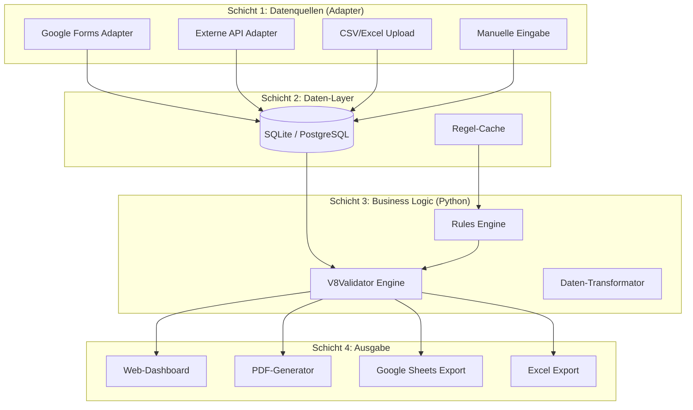

# 🚀 Vision V11: Modulares Zuschuss-System

*Erstellt: 31.01.2026*  
*Status: Detaillierte Planung / Zur Review*  
*Basis: [vision_v10_hybrid.md.resolved](file:///Users/deniskarbach/git/ZuschussCVJM/vision_v10_hybrid.md.resolved)*

---

## 📋 Executive Summary

Die V8-Architektur hat beeindruckende Komplexität in Google Sheets-Formeln erreicht (260+ Zeilen LET-Formeln mit LAMBDA, MAP, REGEX). Das V10-Konzept skizzierte einen Hybrid-Ansatz. **V11 geht noch weiter:** 

Ein **vollständig modulares System**, das:
1. **Google Sheets nur noch für die Datenanzeige nutzt** (keine Logik mehr)
2. **Multiple Datenquellen parallel unterstützt** (Google Forms, API, CSV-Upload)
3. **Die gesamte Regellogik in sauberen, testbaren Python-Code überführt**
4. **Ein Web-Frontend für Audit und PDF-Export bereitstellt**

---

## 🔍 Problemanalyse des aktuellen Systems

### Stärken der V8-Architektur
| Aspekt | Aktueller Stand |
|--------|-----------------|
| Regelbasiert | Ja, via CACHE_RULES |
| Flexibel | Ja, OUTPUT_COLUMNS, LABEL_MAP |
| Multi-Region | Ja, pro Landkreis/Land |

### Limitierungen der V8-Architektur

| Problem | Auswirkung |
|---------|------------|
| 260-Zeilen-Formeln | Schwer wartbar, nicht debugfähig |
| Sheet-Abhängigkeit | TN_LISTE muss in jedem Sheet existieren |
| Keine echte API | Keine Integration mit anderen Systemen |
| Manueller Import | Copy/Paste von Anmeldedaten |
| Keine automatischen Tests | Python-Simulator als Workaround |

> [!IMPORTANT]
> Das Hauptproblem: **Die Logik ist in der falschen Schicht**. Google Sheets ist ein Darstellungs-Tool, keine Programmiersprache.

---

## 🏗️ V11 Architektur: Das 4-Schichten-Modell



---

## 📦 Modul 1: Datenquellen-Adapter

Das Herzstück von V11 ist die **einheitliche Datenquelle-Abstraktion**. Egal woher die Teilnehmerdaten kommen – sie werden alle in ein standardisiertes Format überführt.

### 1.1 Adapter-Interface

```python
from abc import ABC, abstractmethod
from dataclasses import dataclass
from datetime import date
from typing import Optional, List
from enum import Enum

class Funktion(Enum):
    TN = "TN"           # Teilnehmer
    MA = "MA"           # Mitarbeiter
    LEITUNG = "LEITUNG" # Leitung
    REF = "REF"         # Referent

@dataclass
class Teilnehmer:
    """Standard-Datenstruktur für alle Datenquellen"""
    id: str
    vorname: str
    nachname: str
    geburtsdatum: date
    funktion: Funktion
    status: str  # "Angemeldet", "Abgemeldet", etc.
    
    # Adresse
    strasse: str
    plz: str
    wohnort: str
    landkreis: Optional[str] = None
    bundesland: Optional[str] = None
    
    # Optionale Felder
    geschlecht: Optional[str] = None
    behinderung: Optional[str] = None
    sozial: Optional[str] = None
    anwesenheit_tage: Optional[int] = None
    
    # Metadaten
    quelle: str = "manual"  # "google_forms", "api", "csv"
    import_timestamp: Optional[str] = None

class DataSourceAdapter(ABC):
    """Basis-Interface für alle Datenquellen-Adapter"""
    
    @abstractmethod
    def connect(self) -> bool:
        """Verbindung zur Datenquelle herstellen"""
        pass
    
    @abstractmethod
    def fetch_participants(self) -> List[Teilnehmer]:
        """Teilnehmerdaten abrufen und normalisieren"""
        pass
    
    @abstractmethod
    def get_source_name(self) -> str:
        """Name der Datenquelle für Logging/Audit"""
        pass
```

### 1.2 Google Forms Adapter

```python
class GoogleFormsAdapter(DataSourceAdapter):
    """
    Holt Antworten direkt aus Google Forms via Sheets API.
    Vorteil: Nutzer können weiterhin bekannte Google Forms nutzen.
    """
    
    def __init__(self, spreadsheet_id: str, column_mapping: dict):
        self.spreadsheet_id = spreadsheet_id
        self.column_mapping = column_mapping
        # Beispiel column_mapping:
        # {
        #     "timestamp": "A",
        #     "nachname": "B", 
        #     "vorname": "C",
        #     "geburtsdatum": "D",
        #     ...
        # }
    
    def connect(self) -> bool:
        # Google OAuth Flow
        pass
    
    def fetch_participants(self) -> List[Teilnehmer]:
        # 1. Sheets API: Antworten-Sheet lesen
        # 2. Column-Mapping anwenden
        # 3. PLZ -> Landkreis/Bundesland auflösen (via PLZDB)
        # 4. Normalisierte Teilnehmer-Liste zurückgeben
        pass
```

### 1.3 CSV/Excel Upload Adapter

```python
class CSVUploadAdapter(DataSourceAdapter):
    """
    Erlaubt direkten Upload von Teilnehmerlisten.
    Ideal für: Externe Anmeldungs-Systeme, historische Daten
    """
    
    def __init__(self, file_path: str, format_config: dict):
        self.file_path = file_path
        self.format_config = format_config
    
    def fetch_participants(self) -> List[Teilnehmer]:
        # Pandas für flexibles Parsing
        import pandas as pd
        df = pd.read_csv(self.file_path, **self.format_config)
        # Mapping auf Teilnehmer-Objekte
        pass
```

### 1.4 Externes API Adapter

```python
class ExternalAPIAdapter(DataSourceAdapter):
    """
    Für spätere Integration mit:
    - Vereins-Management-Software
    - Andere Anmelde-Plattformen (Eventbrite, etc.)
    - ERP-Systeme
    """
    
    def __init__(self, api_url: str, auth_config: dict):
        self.api_url = api_url
        self.auth_config = auth_config
    
    def fetch_participants(self) -> List[Teilnehmer]:
        # REST API Call mit Authentifizierung
        # Response-Mapping
        pass
```

---

## 📦 Modul 2: Rules Engine (V8-Logik in Python)

Die gesamte Logik aus den V8-Formeln wird sauber in Python-Klassen überführt.

### 2.1 Regel-Datenstruktur

```python
@dataclass
class SubsidyRule:
    """Bildet eine Zeile aus CACHE_RULES ab"""
    
    # Identifikation
    key: str  # z.B. "Landkreis Rhein-Lahn-Kreis_Soziale_Bildung"
    landkreis: str
    event_typ: str
    
    # Mengen-Regeln
    min_anzahl: int
    min_anzahl_bezug: str  # "TN", "MA", "ALLE"
    min_tage: int
    min_anwesenheit: int
    
    # Alters-Regeln
    min_alter_tn_hard: int
    max_alter_tn_hard: int
    min_alter_tn_soft: int
    min_alter_ma: int
    min_alter_leitung: int
    
    # Teilnehmergruppen
    target_groups: List[str]  # ["TN", "MA", "LEITUNG"]
    must_be_local: List[str]  # Welche Gruppen müssen lokal sein
    
    # Quote
    min_quote: float
    quote_mode: str  # "PROZENT", "MEHRHEIT"
    quote_bezug: str
    quote_action: str  # "SOLIDARISCH", "STRIKT_LOKAL"
    
    # Ausgabe
    output_columns: List[str]
    label_map: dict
    sort_order: List[str]
```

### 2.2 V8 Validator Engine

```python
class V8ValidatorEngine:
    """
    Kernlogik: Validiert Teilnehmer gegen Regeln.
    Direkte Übersetzung der 260-Zeilen-Formel in lesbaren Code.
    """
    
    def __init__(self, rule: SubsidyRule, event_start: date, event_end: date):
        self.rule = rule
        self.event_start = event_start
        self.event_end = event_end
        self.measure_duration = (event_end - event_start).days + 1
    
    def validate_measure_duration(self) -> tuple[bool, str]:
        """Prüft: Ist die Maßnahme lang genug?"""
        if self.rule.min_tage == 0:
            return True, "Keine Mindestdauer erforderlich"
        
        ok = self.measure_duration >= self.rule.min_tage
        msg = f"Dauer: {self.measure_duration} Tage (Min: {self.rule.min_tage})"
        return ok, msg
    
    def calculate_age(self, geburtsdatum: date) -> int:
        """Berechnet Alter zum Maßnahme-Ende"""
        return (self.event_end - geburtsdatum).days // 365
    
    def is_age_valid(self, person: Teilnehmer) -> bool:
        """Prüft Alter je nach Funktion"""
        age = self.calculate_age(person.geburtsdatum)
        
        if person.funktion == Funktion.TN:
            min_age = self.rule.min_alter_tn_soft or self.rule.min_alter_tn_hard
            max_age = self.rule.max_alter_tn_hard or 999
            return min_age <= age <= max_age
        
        elif person.funktion == Funktion.LEITUNG:
            return age >= self.rule.min_alter_leitung
        
        elif person.funktion == Funktion.MA:
            return age >= self.rule.min_alter_ma
        
        return True
    
    def is_in_target_group(self, person: Teilnehmer) -> bool:
        """Prüft: Gehört Person zur Zielgruppe?"""
        return person.funktion.value in self.rule.target_groups
    
    def is_local(self, person: Teilnehmer) -> bool:
        """Prüft: Wohnt Person im Zuständigkeitsbereich?"""
        # Für Landkreise: Landkreis prüfen
        # Für Landesjugendplan: Bundesland prüfen
        if "Land" in self.rule.key:
            return person.bundesland == self.rule.landkreis
        return person.landkreis == self.rule.landkreis
    
    def evaluate_participants(self, participants: List[Teilnehmer]) -> dict:
        """
        Hauptmethode: Evaluiert alle Teilnehmer gegen die Regeln.
        Gibt strukturiertes Ergebnis zurück.
        """
        
        # Phase 1: Basis-Filter
        candidates = []
        excluded = []
        
        for p in participants:
            if p.status != "Angemeldet":
                excluded.append((p, "Status: Nicht angemeldet"))
                continue
            
            if not self.is_in_target_group(p):
                excluded.append((p, "Nicht in Zielgruppe"))
                continue
            
            if not self.is_age_valid(p):
                excluded.append((p, f"Alter außerhalb Bereich"))
                continue
            
            # Local-Check für bestimmte Gruppen
            if p.funktion.value in self.rule.must_be_local:
                if not self.is_local(p):
                    excluded.append((p, "Muss lokal sein"))
                    continue
            
            candidates.append(p)
        
        # Phase 2: Quote-Berechnung
        local_count = sum(1 for p in candidates if self.is_local(p))
        total_count = len(candidates)
        
        quote_pct = local_count / total_count if total_count > 0 else 0
        
        if self.rule.quote_mode == "MEHRHEIT":
            quote_ok = local_count > (total_count - local_count)
        else:
            quote_ok = quote_pct >= self.rule.min_quote
        
        # Phase 3: Finale Filterung basierend auf Quote
        final_list = []
        if self.rule.quote_action == "SOLIDARISCH" and not quote_ok:
            # Nur Lokale nehmen
            final_list = [p for p in candidates if self.is_local(p)]
        elif self.rule.quote_action == "STRIKT_LOKAL":
            final_list = [p for p in candidates if self.is_local(p)]
        else:
            final_list = candidates
        
        # Phase 4: Sortierung
        final_list = self._sort_participants(final_list)
        
        return {
            "success": True,
            "final_list": final_list,
            "excluded": excluded,
            "statistics": {
                "total_input": len(participants),
                "candidates": len(candidates),
                "local_count": local_count,
                "quote_percent": quote_pct,
                "quote_ok": quote_ok,
                "final_count": len(final_list)
            }
        }
    
    def _sort_participants(self, participants: List[Teilnehmer]) -> List[Teilnehmer]:
        """Sortiert nach SORT_ORDER aus Regel"""
        # Implementierung der Sortier-Logik
        # LOKAL_FIRST, ALPHA, FUNKTION_ALPHA, etc.
        pass
```

---

## 📦 Modul 3: Output-Generatoren

### 3.1 PDF-Generator

```python
from weasyprint import HTML, CSS

class PDFGenerator:
    """Generiert druckfertige Zuschusslisten als PDF"""
    
    def __init__(self, template_path: str):
        self.template_path = template_path
    
    def generate(self, 
                 participants: List[Teilnehmer],
                 rule: SubsidyRule,
                 event_metadata: dict) -> bytes:
        """
        Generiert PDF mit:
        - Kopfzeile (Träger, Maßnahme, Datum)
        - Teilnehmer-Tabelle nach Layout-Vorgabe
        - Seitenumbrüche an korrekten Stellen
        """
        
        html = self._render_template(participants, rule, event_metadata)
        return HTML(string=html).write_pdf()
```

### 3.2 Google Sheets Export

```python
class SheetsExporter:
    """
    Schreibt validierte Daten zurück nach Google Sheets.
    NUR Daten, keine Formeln!
    """
    
    def export_to_sheet(self, 
                        spreadsheet_id: str,
                        sheet_name: str,
                        participants: List[Teilnehmer],
                        columns: List[str]) -> bool:
        """
        Schreibt die finale Teilnehmerliste in ein Sheet.
        Das Sheet dient NUR der Anzeige/Druck.
        """
        pass
```

---

## 🌐 Modul 4: Web-Frontend

### 4.1 Dashboard-Features

```
┌─────────────────────────────────────────────────────────────────┐
│  🏕️ Powertag 2026 - Zuschuss-Dashboard                         │
├─────────────────────────────────────────────────────────────────┤
│                                                                 │
│  📊 Übersicht                                                   │
│  ┌──────────────┐ ┌──────────────┐ ┌──────────────┐            │
│  │ 45           │ │ 38           │ │ 7            │            │
│  │ Angemeldet   │ │ Förderfähig  │ │ Ausgeschl.   │            │
│  └──────────────┘ └──────────────┘ └──────────────┘            │
│                                                                 │
│  📋 Status nach Landkreis                                       │
│  ┌─────────────────────────────────────────────────────────┐    │
│  │ Rhein-Lahn-Kreis    │ 22 TN │ ✅ Quote OK (68%)       │    │
│  │ Westerwaldkreis     │  8 TN │ ✅ Drucken             │    │
│  │ Rheinland-Pfalz     │ 36 TN │ ✅ Landesjugendplan   │    │
│  └─────────────────────────────────────────────────────────┘    │
│                                                                 │
│  🔍 Audit-Log (Wer wurde warum ausgeschlossen?)                │
│  ┌─────────────────────────────────────────────────────────┐    │
│  │ Max Müller      │ TN │ ❌ Alter: 29 (Max: 26)        │    │
│  │ Lisa Schmidt    │ MA │ ❌ Bundesland: Hessen         │    │
│  └─────────────────────────────────────────────────────────┘    │
│                                                                 │
│  [📄 PDF: Rhein-Lahn] [📄 PDF: Land RLP] [📊 Excel Export]     │
│                                                                 │
└─────────────────────────────────────────────────────────────────┘
```

### 4.2 Tech-Stack für Frontend

| Komponente | Technologie | Begründung |
|------------|-------------|------------|
| Framework | **Svelte** oder **React** | Modern, reaktiv, schnell |
| Styling | Tailwind CSS | Rapid Prototyping |
| State | Zustand / Svelte Stores | Einfaches State Management |
| Tables | TanStack Table | Sortieren, Filtern, Virtualisierung |

---

## 📐 API-Spezifikation

### REST-Endpoints

```yaml
openapi: 3.0.0
info:
  title: Zuschuss V11 API
  version: 1.0.0

paths:
  /api/events:
    post:
      summary: Neue Maßnahme erstellen
      requestBody:
        content:
          application/json:
            schema:
              type: object
              properties:
                name: { type: string }
                start_date: { type: string, format: date }
                end_date: { type: string, format: date }
                traeger: { type: string }
                event_typ: { type: string }
    
  /api/events/{event_id}/participants:
    get:
      summary: Teilnehmer abrufen
    post:
      summary: Teilnehmer hinzufügen

  /api/events/{event_id}/validate:
    post:
      summary: Validierung durchführen
      requestBody:
        content:
          application/json:
            schema:
              type: object
              properties:
                rule_key: { type: string }
      responses:
        200:
          description: Validierungsergebnis
          content:
            application/json:
              schema:
                type: object
                properties:
                  success: { type: boolean }
                  final_list: { type: array }
                  excluded: { type: array }
                  statistics: { type: object }

  /api/events/{event_id}/export/pdf:
    post:
      summary: PDF generieren
      requestBody:
        content:
          application/json:
            schema:
              type: object
              properties:
                rule_key: { type: string }
                template: { type: string }
      responses:
        200:
          content:
            application/pdf: {}

  /api/datasources:
    get:
      summary: Verfügbare Datenquellen auflisten
    post:
      summary: Neue Datenquelle konfigurieren
      
  /api/datasources/{source_id}/sync:
    post:
      summary: Daten von Quelle synchronisieren
```

---

## 🗄️ Datenbank-Schema

```sql
-- Maßnahmen
CREATE TABLE events (
    id UUID PRIMARY KEY,
    name VARCHAR(255) NOT NULL,
    start_date DATE NOT NULL,
    end_date DATE NOT NULL,
    traeger VARCHAR(255),
    event_typ VARCHAR(100),
    created_at TIMESTAMP DEFAULT NOW()
);

-- Teilnehmer
CREATE TABLE participants (
    id UUID PRIMARY KEY,
    event_id UUID REFERENCES events(id),
    external_id VARCHAR(100),  -- ID aus Datenquelle
    
    vorname VARCHAR(100) NOT NULL,
    nachname VARCHAR(100) NOT NULL,
    geburtsdatum DATE NOT NULL,
    funktion VARCHAR(20) NOT NULL,
    status VARCHAR(50) DEFAULT 'Angemeldet',
    
    strasse VARCHAR(255),
    plz VARCHAR(10),
    wohnort VARCHAR(100),
    landkreis VARCHAR(100),
    bundesland VARCHAR(50),
    
    geschlecht VARCHAR(10),
    behinderung VARCHAR(50),
    sozial VARCHAR(50),
    anwesenheit_tage INTEGER,
    
    source VARCHAR(50),  -- google_forms, csv, api, manual
    source_timestamp TIMESTAMP,
    created_at TIMESTAMP DEFAULT NOW()
);

-- Regeln (aus CACHE_RULES migriert)
CREATE TABLE subsidy_rules (
    id UUID PRIMARY KEY,
    key VARCHAR(255) UNIQUE NOT NULL,
    landkreis VARCHAR(100),
    event_typ VARCHAR(100),
    
    min_anzahl INTEGER DEFAULT 0,
    min_anzahl_bezug VARCHAR(20),
    min_tage INTEGER DEFAULT 0,
    min_anwesenheit INTEGER DEFAULT 0,
    
    min_alter_tn_hard INTEGER DEFAULT 0,
    max_alter_tn_hard INTEGER DEFAULT 0,
    min_alter_tn_soft INTEGER DEFAULT 0,
    min_alter_ma INTEGER DEFAULT 0,
    min_alter_leitung INTEGER DEFAULT 0,
    
    target_groups TEXT[], -- PostgreSQL Array
    must_be_local TEXT[],
    
    min_quote DECIMAL(3,2) DEFAULT 0,
    quote_mode VARCHAR(20),
    quote_bezug VARCHAR(50),
    quote_action VARCHAR(20),
    
    output_columns TEXT,
    label_map JSONB,
    sort_order TEXT[],
    
    is_active BOOLEAN DEFAULT TRUE,
    updated_at TIMESTAMP DEFAULT NOW()
);

-- PLZ-Datenbank
CREATE TABLE plz_database (
    plz VARCHAR(10) PRIMARY KEY,
    ort VARCHAR(100),
    landkreis VARCHAR(100),
    bundesland VARCHAR(50)
);

-- Datenquellen-Konfiguration
CREATE TABLE data_sources (
    id UUID PRIMARY KEY,
    name VARCHAR(100) NOT NULL,
    type VARCHAR(50) NOT NULL, -- google_forms, csv, api
    config JSONB NOT NULL,     -- Adapter-spezifische Konfiguration
    is_active BOOLEAN DEFAULT TRUE,
    last_sync TIMESTAMP
);

-- Audit-Log
CREATE TABLE validation_log (
    id UUID PRIMARY KEY,
    event_id UUID REFERENCES events(id),
    rule_key VARCHAR(255),
    validated_at TIMESTAMP DEFAULT NOW(),
    
    input_count INTEGER,
    output_count INTEGER,
    excluded_count INTEGER,
    
    statistics JSONB,
    excluded_details JSONB
);
```

---

## 🔄 Migrations-Strategie: V8 → V11

### Phase 1: Parallel-Betrieb (Woche 1-4)
- V11 liest CACHE_RULES aus bestehendem Master-Sheet
- Validierung läuft parallel zu V8-Formeln
- Ergebnisse werden verglichen (Diff-Report)

### Phase 2: Backend-First (Woche 5-8)
- V8Validator-Engine komplett implementiert
- Alle Regeln als Python-Tests validiert
- PDF-Export funktional

### Phase 3: Datenquellen-Integration (Woche 9-12)
- Google Forms Adapter produktiv
- CSV-Upload für bestehende Listen
- Web-Dashboard MVP

### Phase 4: Rollout (Woche 13-16)
- Training für Freizeitleiter
- Dokumentation
- Erste echte Freizeiten über V11

---

## 💰 Hosting & Kosten

| Komponente | Option 1 (Minimal) | Option 2 (Standard) |
|------------|-------------------|---------------------|
| Backend | Railway Free Tier | Hetzner VPS (5€/Mo) |
| Database | SQLite (lokal) | PostgreSQL (Supabase Free) |
| Frontend | Vercel Free | Vercel Free |
| **Gesamt** | **0€/Monat** | **5€/Monat** |

---

## 📁 Vorgeschlagene Projektstruktur

```
zuschuss-v11/
├── backend/
│   ├── adapters/
│   │   ├── __init__.py
│   │   ├── base.py           # DataSourceAdapter ABC
│   │   ├── google_forms.py
│   │   ├── csv_upload.py
│   │   └── external_api.py
│   ├── core/
│   │   ├── __init__.py
│   │   ├── models.py          # Teilnehmer, SubsidyRule
│   │   ├── validator.py       # V8ValidatorEngine
│   │   └── plz_resolver.py    # PLZ → Landkreis/Bundesland
│   ├── export/
│   │   ├── pdf_generator.py
│   │   ├── sheets_exporter.py
│   │   └── excel_exporter.py
│   ├── api/
│   │   ├── main.py            # FastAPI app
│   │   ├── routes/
│   │   │   ├── events.py
│   │   │   ├── participants.py
│   │   │   ├── validation.py
│   │   │   └── datasources.py
│   │   └── deps.py            # Dependencies
│   ├── tests/
│   │   ├── test_validator.py
│   │   ├── test_adapters.py
│   │   └── fixtures/          # Test-Daten
│   └── requirements.txt
├── frontend/
│   ├── src/
│   │   ├── routes/
│   │   │   ├── +page.svelte       # Dashboard
│   │   │   ├── events/
│   │   │   └── audit/
│   │   ├── lib/
│   │   │   ├── components/
│   │   │   └── api.ts
│   │   └── app.html
│   └── package.json
├── docs/
│   ├── api.md
│   ├── migration.md
│   └── rules-reference.md
└── docker-compose.yml
```

---

## ✅ Vorteile gegenüber V8

| Aspekt | V8 (Sheets) | V11 (Modular) |
|--------|-------------|---------------|
| Testbarkeit | ❌ Manuell | ✅ Automatische Tests |
| Debugging | ❌ Formel-Analyse | ✅ Logging, Breakpoints |
| Performance | ⚠️ Bei vielen TN langsam | ✅ Skalierbar |
| Datenquellen | ❌ Nur Copy/Paste | ✅ Google Forms, API, CSV |
| Versionierung | ❌ Sheet-Kopien | ✅ Git |
| Zusammenarbeit | ⚠️ Sheet-Chaos | ✅ Zentrales Backend |
| Offline-Fähigkeit | ❌ Nein | ✅ Progressive Web App |

---

## 🎯 Nächste Schritte

1. **Review dieses Plans** – Gibt es Wünsche/Änderungen?
2. **Entscheidung: Voll-Implementierung oder MVP-First?**
   - MVP: Nur Validator + PDF-Export, ohne Web-Frontend
   - Voll: Komplettes System inkl. Dashboard
3. **Technologie-Entscheidungen bestätigen**:
   - Python FastAPI ✅
   - Svelte oder React für Frontend?
   - SQLite (einfach) oder PostgreSQL (skalierbar)?
4. **Prototyp starten**: V8Validator-Klasse als erste Komponente

---

## 🔗 Referenzen

- [vision_v10_hybrid.md.resolved](file:///Users/deniskarbach/git/ZuschussCVJM/vision_v10_hybrid.md.resolved) - Basis-Konzept
- [rheinlandpfalzV8.txt](file:///Users/deniskarbach/git/ZuschussCVJM/RLP/Land/RLP/rheinlandpfalzV8.txt) - V8 Formel-Referenz
- [rheinlahnkreisV8.txt](file:///Users/deniskarbach/git/ZuschussCVJM/RLP/Kreise/Rhein-Lahn-Kreis/rheinlahnkreisV8.txt) - V8 Formel-Referenz
