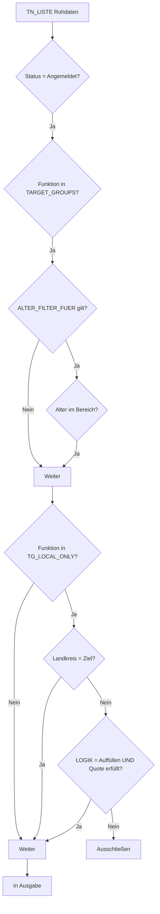

# V7 Brainstorming Stand (2026-01-22)

## Kritische Analyse der RULES-Logik

---

## 1. FILTER_FUNCTION

| FILTER_FUNCTION | Gibt aus | Anwendungsfall |
|-----------------|----------|----------------|
| `ALL` | TN + MA + LEITUNG + REF | Standard (eine Liste) |
| `TN_ONLY` | Nur TN | MA-Bereich separat |
| `STAFF_ONLY` | MA + LEITUNG | TN-Bereich separat |
| `REF_ONLY` | Nur REF | REF-Bereich separat |

---

## 2. Quote-Bezugsgruppe

**Aktuell (V6):** Quote bezieht sich nur auf **TN**.

| Option | Bezugsgruppe | Konsequenz |
|--------|--------------|------------|
| **A (aktuell)** | Nur TN | MA zählen nicht für Quote |
| **B** | Alle (TN+MA+LEITUNG) | MA beeinflussen Quote |
| **C** | Konfigurierbar via RULES | Neue Spalte `QUOTE_BEZUG` |

**Empfehlung:** Option A beibehalten.

---

## 3. Altersfilter pro Funktion

**Vorschlag:** Neue Spalte `ALTER_FILTER_FUER`

| Wert | Bedeutung |
|------|-----------|
| `TN` (Standard) | Nur TN werden gefiltert |
| `TN;MA` | TN und MA werden gefiltert |
| `ALL` | Alle Funktionen |
| `NONE` | Kein Altersfilter |

---

## 4. SORT_ORDER

| Wert | Sortierung |
|------|------------|
| `LOKAL_FIRST;ALPHA` | Lokale zuerst, dann alphabetisch |
| `ALPHA_ONLY` | Nur alphabetisch |
| `FUNCTION_FIRST;ALPHA` | Nach Funktion, dann alpha |
| `NONE` | Keine Sortierung |

---

## 5. RULES-Struktur (V7)

| Spalte | Feld | Neu/Alt |
|--------|------|---------|
| A | KEY | Alt |
| B-D | Meta (Landkreis, Typ, Kürzel) | Alt |
| E | FOERDER_UMFANG | Alt |
| F | MIN_TN | Alt |
| G | MIN_ALTER | Alt |
| H | MAX_ALTER | Alt |
| I | MIN_ALTER_SOFT | Alt |
| J | MIN_TAGE | Alt |
| K | MIN_QUOTE | Alt |
| L | QUOTE_MODUS | Alt |
| M | LOGIK | Alt |
| **N** | TARGET_GROUPS | Neu |
| **O** | TG_LOCAL_ONLY | Neu |
| **P** | ALTER_FILTER_FUER | Neu |
| **Q** | LABEL_MAP | Neu |
| **R** | OUTPUT_COLUMNS | Neu |
| **S** | SORT_ORDER | Neu |
| **T** | FILTER_FUNCTION | Neu |
| **U** | PROPERTY_MAP | Neu |

---

## 6. Logik-Kette

---

## 7. Offene Entscheidungen

| Frage | Optionen |
|-------|----------|
| Quote-Bezugsgruppe | A) Nur TN, B) Alle, C) Konfigurierbar |
| Altersfilter konfigurierbar | Ja / Nein |

---

## 8. TN_LISTE Struktur

| Bereich | Spalten | Inhalt |
|---------|---------|--------|
| **Input** | B:C | Status, Anwesenheit (manuell) |
| **Meta** | D:M | Funktion, Juleica, Behinderung, etc. |
| **Daten** | N:AM (26) | Name, Vorname, PLZ, etc. |
| **Auto** | AN:AP | Alter, Landkreis, Bundesland |

---

## 9. Nächste Schritte

1. [ ] RULES-Spalten N-U anlegen
2. [ ] COL_DEF finalisieren
3. [ ] TN_LISTE Spalten festlegen
4. [ ] V7 Prototyp entwickeln

